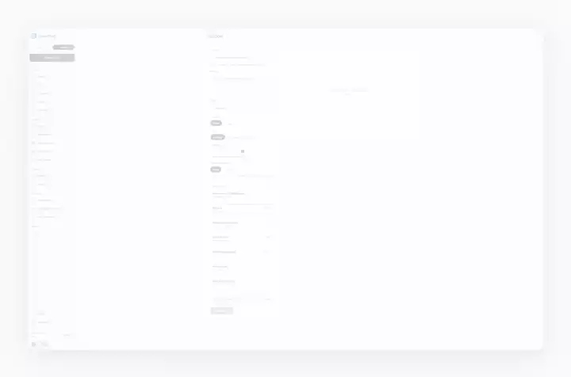
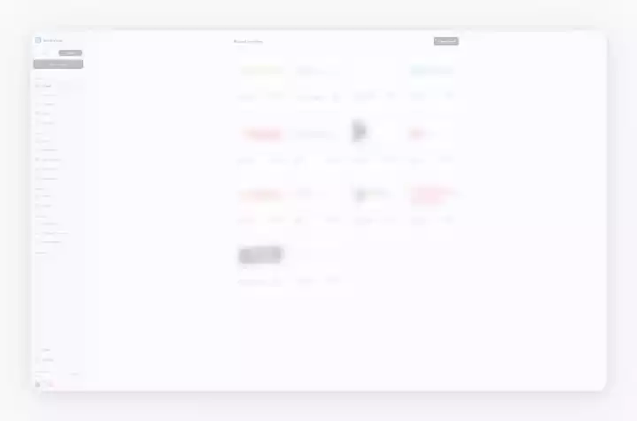

# Product Demo Video Workflow

A no-install pipeline for turning a **real web app** into polished, "playable" product-demo
videos for a landing page. The UI is captured live (real DOM, real interactions), de-branded,
then finished with a smooth synthetic cursor, zoom-to-click, a framed backdrop, and click sounds
synced to the actual interactions. Built on **Playwright + ffmpeg + Pillow** — nothing to install
beyond those.

The output is one short (~10-15s) `.mp4` per section, sized for autoplay-muted-loop embedding.

## Example output

Two clips produced end to end with this pipeline — captured live from a real deployed app, de-branded
during capture, then finished with the post-zoom camera and the framed backdrop. The previews below
are compressed animated WebP; click through for the actual `.mp4` renders.

**Compose — one screen, single pass** ([demo-compose.mp4](assets/demo-compose.mp4))

[](assets/demo-compose.mp4)

**Library setup — reusable building blocks** ([demo-building-blocks.mp4](assets/demo-building-blocks.mp4))

[](assets/demo-building-blocks.mp4)

## Why this approach

Researched against the current tool landscape (see `RESEARCH.md`). Short version:

- **Real capture beats fabricated animation** for a product/portfolio piece — viewers trust real UI.
- **Autoplay + muted + loop MP4 (H.264)** is the near-universal landing-page embed format.
- **Auto-zoom-to-click + eased cursor** (popularized by Screen Studio) is the single biggest
  "looks studio-made" lever, so the pipeline reproduces both.
- Dedicated tools (Cap, Screen Studio) are great but are screen-recorders: manual, and de-branding
  has to happen live. A scripted capture gives **frame-perfect de-brand control**, so names and
  identifiers you don't want in the final clip never reach a published frame.

## The pipeline

1. **`scripts/record_live.py`** — logs into your deployed app and drives real interactions with
   Playwright, injecting:
   - a decorative smooth cursor + click ripple (headless Chromium renders no pointer),
   - a `de-brand` replacer that redacts identifiers you don't want published from text nodes, input values and
     common attributes (`placeholder`/`title`/`alt`/`aria-label`), re-applied both on an interval
     and on DOM mutations. Best-effort by design: it covers on-screen text, not raster content
     (logos, faces, images) — review the output before publishing,
   - a dark background at load (kills the white flash).
   It records **flat** at a large native viewport with `record_video_size == viewport` (the fix for
   Playwright's soft video — its recorder captures at CSS-pixel size and ignores deviceScaleFactor),
   and logs the real click timestamps to `marks.json` (audio sync) plus a camera keyframe log
   `cam.json` (`{t, x, y, z}` per step) for the post zoom. Artifacts land in
   `out/rec_live_<scene>/` (the paths are printed at the end of the run). No generation is
   triggered, so capturing is free.

2. **`scripts/zoom_pass.py`** — the **virtual camera**. Zoom-to-click is done in post, not in the
   browser: an ffmpeg `zoompan` reads `cam.json` and eases the frame toward each click point
   (smoothstep quick-ease-in → hold → ease-out), landing the zoom ~0.1s *before* each tap.
   This is deliberately post-processing, not a DOM transform: many apps (React/Next portals, fixed
   layouts) silently ignore a CSS `transform` on `body`, so an in-browser camera is fragile — a
   click-log-driven post camera is app-independent, deterministic, and keeps the injected cursor
   perfectly aligned (it's zoomed with the frame). This is the same "auto-zoom from a click log"
   technique Screen Studio / Cap use.

3. **`scripts/finalize_framed.py`** — the premium frame: Pillow builds a dark backdrop with a
   subtle radial glow, a rounded-rectangle alpha mask, and a blurred drop shadow; ffmpeg composites
   the (rounded) video onto the padded backdrop and supersample-downscales for crisp text.

4. **`scripts/add_clicks.py`** — mixes a soft click SFX onto the audio at each real tap time from
   `marks.json` (video stream copied, so no re-encode/quality loss).

## Quick start

```
pip install -r requirements.txt
python -m playwright install chromium
# ffmpeg + ffprobe on PATH (or set FFMPEG=/path/to/ffmpeg FFPROBE=/path/to/ffprobe)
cp scripts/debrand.example.json scripts/debrand.json   # then edit with your own redactions
```

Point the recorder at your app and run, per section (a ready click SFX ships at `assets/click.wav`, a short tone synthesized with ffmpeg and covered by this repo's MIT license):

```
export APP_URL=https://your-app.example
# optional API login: export LOGIN_PATH=/api/auth/login APP_EMAIL=... APP_PASSWORD=...

python scripts/record_live.py <scene> [light]                   # -> out/rec_live_<scene>/ (raw .webm + marks.json + cam.json); 'light' forces light theme from frame 1
python scripts/zoom_pass.py <raw.webm> <cam.json> <zoomed.mp4> [offset] [zmul] [ease] [cx_fixed|none] [zbase]
python scripts/finalize_framed.py <zoomed.mp4> <out.mp4> <bed.wav|none> <ss> <dur> [glow|flat|light]
python scripts/add_clicks.py <out.mp4> <final.mp4> <marks.json> <ss> assets/click.wav [offset]
```

## Configure for your app

Everything app-specific is external, so nothing in the repo is tied to one deployment:

- **`APP_URL`** — your deployed app. Required.
- **`LOGIN_PATH` + `APP_EMAIL` / `APP_PASSWORD`** — optional JSON API login before recording. Leave `LOGIN_PATH` unset for a public app or a UI login flow. On Windows the credentials also resolve from user environment-variable registry entries.
- **`FFMPEG` / `FFPROBE`** — binaries (default: on PATH). **`OUT_DIR`** — output/scratch dir (default: `./out`).
- **Light-theme pin** (when recording `light`) — **`REC_LIGHT_CSS`** points at a CSS file that redefines your app's `:root` and dark-theme custom properties to their light values with `!important`; it is injected at document-create so the app paints light from frame 0. **`REC_THEME_KEY` / `REC_THEME_VALUE`** seed the app's own theme storage key (default `theme` / `light`). Read the real key and light token values from the app's theme provider and global stylesheet. Without `REC_LIGHT_CSS`, only the fallback attribute-force runs, which can flash the default theme for one frame.
- **`scripts/debrand.json`** — the redaction map (gitignored, copied from `debrand.example.json`; override the path with `DEBRAND_CONFIG`). Each entry is `[regex, replacement, flags]`, applied to on-screen text, input values and common attributes on an interval and on DOM mutations. Only the placeholder example ships in the repo. Best-effort on text only — it cannot redact raster logos or faces, so review each render before publishing.
- **`SCENES`** in `record_live.py` — one function per section using Playwright text/role locators. `example` is a generic template (drives the first textbox and button); replace it with your own steps.

## Encode / embed checklist (landing page)

- H.264 MP4, `autoplay muted loop playsinline`, with a `poster` first-frame.
- Budget ~2-4 MB desktop / ~2 MB mobile; 10-15s loop.
- Below-fold sections: `preload="none"` + lazy-load (IntersectionObserver).
- Keep an audio version only for a click-to-watch; the page itself plays muted.
- `aria-label` describing each clip.

## Showing generation output (the "one request, a finished cut out" beat)

A demo of a generative tool is far stronger when it ends on the **real artifact the tool produced**,
not just the UI that requested it. Two extra scripts cover this:

- **`scripts/finalize_output.py`** — frames a portrait (9:16) generated clip on the same light/dark
  backdrop the UI clips use, so the output beat cuts seamlessly after the request beat. It centres
  the portrait, fills the letterbox with a blurred, dimmed copy of the same clip (ambient fill), adds
  rounded corners + shadow + a fade from/to the backdrop colour. Usage:
  `finalize_output.py <portrait.mp4> <out.mp4> <dur|none> [light|dark]`.
- **`record_live.py` request-style scene** — fills the request fields, submits, and captures the
  produced result, rather than stopping at the form.

### Cut dead waiting time out of a real capture

A live capture of a tool that computes for a while will contain dead "thinking" stretches.
**`scripts/cut_segment.py`** removes a `[c0, c1]` span from the raw video **and** shifts the `cam.json`
keyframes and `marks.json` click times past the cut down by the gap, so the post-zoom camera and click
SFX stay aligned. Usage:
`cut_segment.py <raw> <cam.json> <marks.json> <c0> <c1> <out_raw> <out_cam> <out_marks>`.

## Light-mode capture (start light from frame 1, zero flash)

If the target look is light, don't pin the theme by clicking the app's toggle after load. Many apps
run a post-hydration theme effect that bakes one dark frame into the recording anyway. `record_live.py
<scene> light` handles this with a document-create init script that seeds the app's theme storage key
and injects light token overrides (`REC_LIGHT_CSS`, `REC_THEME_KEY` / `REC_THEME_VALUE`, see above),
so the page paints light from frame 0. Use the matching `light` style in `finalize_framed.py` /
`finalize_output.py`.

## Recording etiquette

Record under a dedicated testing account, film only screens you have verified show no data you don't
control, and review the finished frames before publishing. The de-brand pass covers on-screen text,
not raster content like logos or uploaded images.

## License

MIT — see `LICENSE`.
